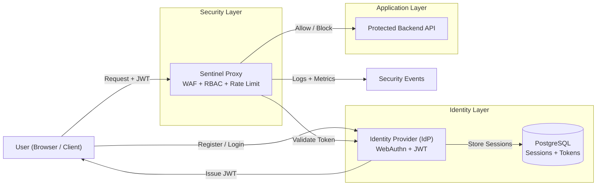

# Sentinel Platform


## Category

Security Engineering / Distributed Systems

---

## Overview

Sentinel Platform is a full zero trust security system built as a connected set of services rather than isolated components.

It demonstrates how identity, access control, and request protection operate together in a real environment:

* identity is issued by a dedicated authentication service
* every request is verified at the edge
* enforcement decisions are made before traffic reaches the application

This is not a collection of tools — it is a working security pipeline.

---

## Core Idea

The platform is built around one principle:

Every request must prove its identity before it is trusted.

There are no implicit sessions, no trusted networks, and no bypass paths.

Identity is created, verified, and enforced on every request.

---

## System Architecture

Sentinel Platform is composed of two independent services that work together to enforce a zero trust model.

---

## Architecture Diagram



---

## Live System Layer

The platform is paired with a frontend system (Sentinel OS) that visualizes behavior in real time.

This includes:

* live request logs streamed from the proxy
* system metrics (allowed vs blocked traffic)
* simulated attack scenarios
* interaction between system components

This layer turns the backend system into something observable and interactive, rather than static.

---

### Identity Layer

**Zero Trust Identity Provider**  
https://github.com/blacAxe/zero-trust-identity-provider

Handles:

- Passkey-based authentication (WebAuthn)
- JWT access token issuance
- Refresh token lifecycle and session management
- User identity and role propagation

---

### Security Enforcement Layer

**Sentinel Proxy**  
https://github.com/blacAxe/sentinel-proxy

Handles:

- Reverse proxy request routing
- JWT validation and role-based access control
- Web Application Firewall (WAF)
- Rate limiting and request filtering
- Security logging and metrics

---

### Request Flow

1. User authenticates through the Identity Provider  
2. IdP issues an access token (JWT)  
3. Client sends requests through Sentinel Proxy  
4. Proxy validates token and enforces policies  
5. Request is forwarded to the target service if allowed  

---

This separation reflects how production systems isolate identity from enforcement for scalability and security.

---

## Repositories

| Component | Description | Link |
|----------|------------|------|
| Identity Provider | Authentication, tokens, sessions | https://github.com/blacAxe/zero-trust-identity-provider |
| Sentinel Proxy | Security enforcement, WAF, routing | https://github.com/blacAxe/sentinel-proxy |

---

## Key Features

### Passkey Authentication

* Passwordless login using WebAuthn
* Hardware-backed or biometric authentication
* Resistant to phishing and credential theft

### Token-Based Identity

* Short-lived JWT access tokens
* Role embedded directly in token
* Stateless verification at the proxy layer

### Refresh Token Lifecycle

* Long-lived refresh tokens stored in database
* Hashed before storage
* Used to issue new access tokens without re-authentication

### Role-Based Access Control

* Routes such as /api/admin and /api/user enforced at proxy level
* Admin-only endpoints blocked for non-admin users
* Identity enforced before reaching backend

### Web Application Firewall (WAF)

* Detects common attack patterns such as:

  * SQL injection
  * XSS
  * suspicious query patterns
* Blocks malicious requests before they hit the application

### Rate Limiting

* Per-IP request limiting
* Protects against brute force and scanning

### Observability

* Structured security events generated for every request
* Real-time logging and metrics
* Visibility into allowed vs blocked traffic

---

## Example Flow

### Admin Access (Allowed)

Request:

curl -H "Authorization: Bearer <admin_token>" http://localhost:8081/api/admin

Result:

200 OK → Request passes through proxy and returns admin data

---

### User Access to Admin Route (Blocked)

Request:

curl -H "Authorization: Bearer <user_token>" http://localhost:8081/api/admin

Result:

403 Forbidden → blocked by proxy

---

### Malicious Request (Blocked by WAF)

Request:

curl "http://localhost:8081/get?q=SELECT FROM users"

Result:

Blocked before reaching backend

---

## Project Structure

### Identity Provider

* /handlers → authentication, token logic, WebAuthn flows
* /db → PostgreSQL integration and session storage
* /static → frontend for login and testing

### Sentinel Proxy

* /proxy → reverse proxy and routing logic
* /middleware → rate limiting, WAF, request pipeline
* /events → structured security logging
* /metrics → traffic and attack analytics
* /config → environment configuration

---

## Running the Platform

Sentinel Platform is fully containerized and runs as a multi-service system using Docker Compose.

All services are designed to run together as a single system using Docker, mirroring how distributed services are deployed in production environments.

---

### 1. Prerequisites

* Docker
* Docker Compose

---

### 2. Start the System

From the root directory:

```bash
docker compose up --build
```

---

### 3. Services

Once running, the platform exposes:

* **Identity Provider (IdP)**
  http://localhost:8080

* **Sentinel Proxy (Security Gateway)**
  http://localhost:8081

* **PostgreSQL Database**
  Runs internally (port 5432)

---

### 4. Stopping the System

```bash
docker compose down
```

To remove volumes (fresh reset):

```bash
docker compose down -v
```

---

### 5. Notes

* The database is automatically initialized using `db/init.sql`
* All services are networked internally via Docker
* Environment variables are managed through `docker-compose.yml`
* No manual service startup is required

---

### 6. Quick Test

After startup, verify the system:

```bash
curl http://localhost:8080
curl http://localhost:8081
```

---

### 7. CI Validation

This project includes a GitHub Actions pipeline that:

* Builds all services
* Starts the full system
* Runs integration checks on endpoints

Every push to `main` is automatically tested.
---

## Demo Flow

1. Open browser at localhost:8080
2. Register a passkey
3. Login and receive tokens
4. Send request through proxy:

```bash
curl -H "Authorization: Bearer <token>" http://localhost:8081/api/user
```

5. Try admin route with non-admin token → blocked
6. Try malicious query → blocked by WAF

This demonstrates identity + enforcement working together.

---

## Security Design Decisions

* No password storage anywhere in the system
* Access tokens expire quickly to reduce exposure
* Refresh tokens are hashed and stored server-side
* All access control enforced at the proxy layer
* Every request validated independently
* WAF acts as an additional defensive layer

---

## Tech Stack

* Go (backend services and proxy)
* WebAuthn (passkey authentication)
* PostgreSQL (session and token storage)
* JWT (access and refresh tokens)
* net/http reverse proxy
* Vanilla JavaScript frontend

---

## What This Project Demonstrates

This project shows how to build a real security pipeline:

* designing identity systems from scratch
* enforcing access control at the edge
* building a custom WAF engine
* structuring systems as connected services
* thinking in terms of zero trust architecture

---

## Closing Note

Sentinel Platform is not just an authentication service or a proxy.

It is a system that shows how identity and security should work together in practice.

The goal is to move beyond isolated features and toward a complete, enforceable security model.
